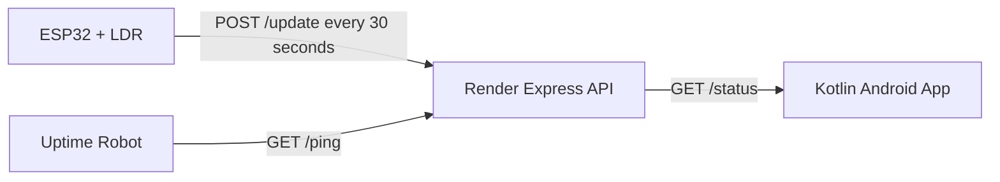

# ESP32 Room Monitor

An IoT room monitoring system built for a public GitHub repository with clean secret handling.

This MVP works today with:

- ESP32 internal chip temperature
- LDR-based light sensing
- Render-hosted Node.js backend
- Jetpack Compose Android app
- In-app Wi-Fi provisioning for the ESP32 through its setup hotspot

Ambient temperature and humidity support through a DHT11 is already scaffolded in the ESP32 code, but intentionally commented out until you have the sensor.

## Architecture



## Repository Structure

```text
ESP32RoomMonitor/
|- .gitignore
|- README.md
|- backend/
|- esp32/
\- android/
```

## Current Sensor Payload

```json
{
  "chipTemperatureC": 34.8,
  "lightRaw": 1460,
  "lightPercent": 64,
  "deviceId": "esp32-room-01",
  "sleepIntervalMinutes": 0.5,
  "deviceSentAt": "2026-05-10T08:30:00Z",
  "serverReceivedAt": "2026-05-10T08:30:02Z",
  "dhtEnabled": false,
  "temperatureC": null,
  "humidity": null
}
```

## Setup Order

1. Configure and run the backend in `backend/`.
2. Deploy the backend to Render and copy the public URL.
3. Add your Wi-Fi credentials and backend URL to `esp32/room_monitor/arduino_secrets.h`.
4. Flash the ESP32 sketch from `esp32/room_monitor/room_monitor.ino`.
5. Add your backend URL and API key to `android/local.properties`.
6. Run the Android app and pull to refresh.
7. If the ESP32 has no Wi-Fi credentials yet, open `Device Setup` in the app and provision the home network.

## Step-by-Step Implementation

### 1. Backend on Render

1. Open `backend/.env.example` and create a local `.env`.
2. Set the same shared `API_KEY` you plan to use in the ESP32 and Android app.
3. Run the backend locally with `npm install` and `npm start`.
4. Test:
   - `GET /ping`
   - `POST /update` with `x-api-key`
   - `GET /status` with `x-api-key`
5. Deploy the `backend/` folder to Render.

### 2. ESP32 Firmware

1. Copy `esp32/room_monitor/arduino_secrets.example.h` into `esp32/room_monitor/arduino_secrets.h`.
2. Fill in:
   - Wi-Fi SSID
   - Wi-Fi password
   - Render base URL
   - shared API key
3. Wire the LDR to GPIO 34 through a safe voltage divider.
4. Flash `esp32/room_monitor/room_monitor.ino`.
5. Confirm the serial monitor shows:
   - Wi-Fi connected
   - chip temperature
   - light reading
   - successful POST
6. The ESP32 then sleeps for 30 seconds between uploads.
7. If Wi-Fi credentials are missing or invalid, the ESP32 starts a hotspot named `ESP32-RoomMonitor-Setup` and waits for the Android app to provision Wi-Fi.

### 3. Android App

1. Open the `android/` folder in Android Studio.
2. Add these keys to `android/local.properties`:

```properties
roomMonitor.baseUrl=https://your-render-service.onrender.com/
roomMonitor.apiKey=your-shared-secret
```

3. Sync Gradle and run the app on a phone or emulator.
4. Use pull-to-refresh to fetch the latest reading.
5. Confirm the app shows:
   - chip temperature card
   - light card with graph
   - device status card
   - last updated timestamp
6. If you need first-time Wi-Fi setup, tap `Device Setup`, connect the phone to the ESP32 hotspot, scan nearby networks, and send the Wi-Fi password from inside the app.

### 4. Later DHT11 Upgrade

1. Install the DHT library in Arduino IDE.
2. Wire the DHT11 to the documented pin in `esp32/README.md`.
3. Uncomment the DHT11 blocks in `esp32/room_monitor/room_monitor.ino`.
4. Change `dhtEnabled` to `true`.
5. Optionally extend the Android UI to show ambient temperature and humidity.

## Security Notes

- `backend/.env` is ignored by Git.
- `esp32/room_monitor/arduino_secrets.h` is ignored by Git.
- `android/local.properties` is ignored by Git and feeds values into `BuildConfig`.

For a hackathon demo this is fine, but remember that Android client secrets can still be extracted from a built APK.

## Future DHT11 Upgrade

When you buy the DHT11 later:

1. Wire the DHT11 to the documented GPIO pin in `esp32/README.md`.
2. Install the DHT library in Arduino IDE.
3. Uncomment the marked DHT11 code blocks in `esp32/room_monitor/room_monitor.ino`.
4. Change `dhtEnabled` to `true`.
5. Optionally show ambient temperature and humidity in the Android UI.
